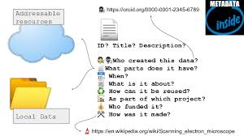

<figure>
    
    <figcaption>RO-Crate example</figcaption>
</figure>
Research objects are a single package that collects the data, code and other resources used in a piece of research and allows it to be a cite-able research output in its own right. At the end of your work with LDaCA text analysis tools, there will be the automated option to package together the components of your workflow, such as

- Raw data
- Transformed data
- A record of the notebooks which you have used
- Additional scripts and codes
- Results
- Visualisations
- High quality metadata

LDaCA analysis tools will output an RO-Crate that contains these objects. An output of this kind can be assigned a unique identifier (such as a doi), and it can be published via services such as Zenodo or figshare so it can be cited in publications. This will make it easy to fulfil the increasingly common requirement of journals to make available the data that supports a publication.